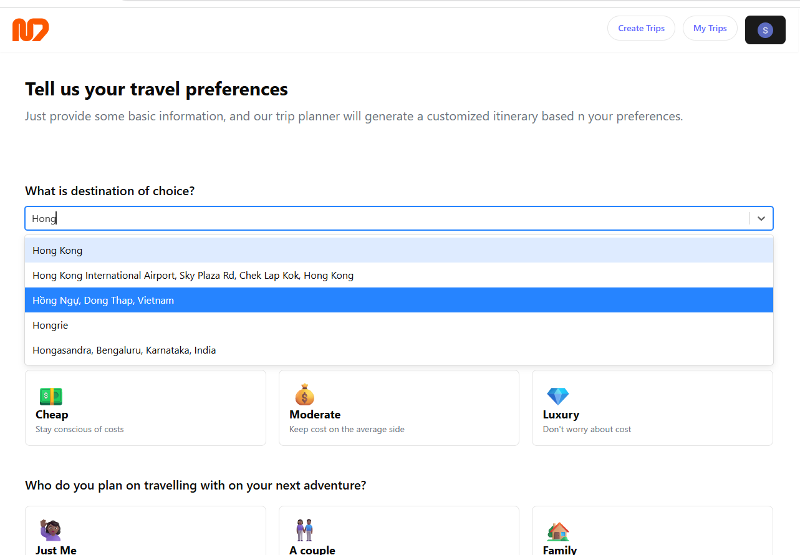
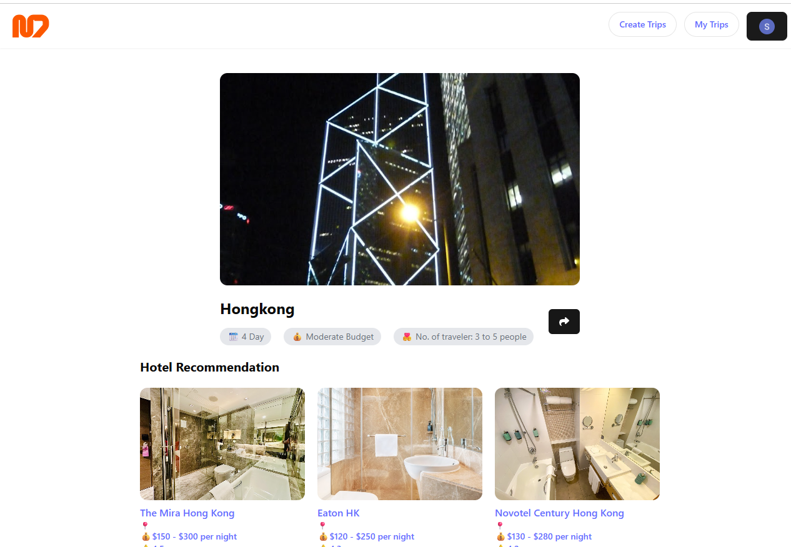
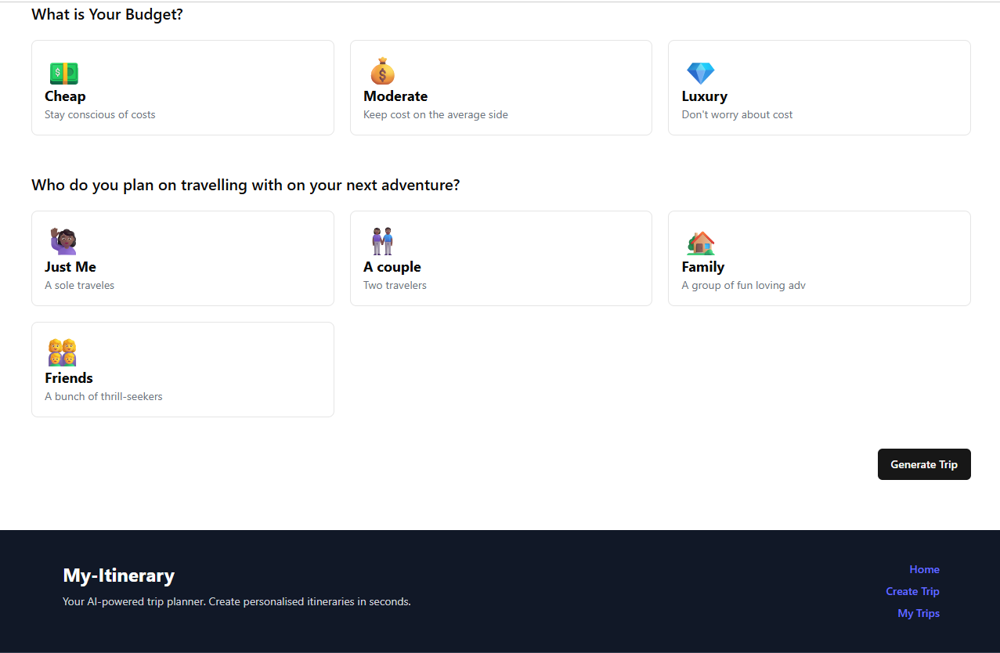

# 🧳 AI-Powered Trip Itinerary Generator

This is a **full-stack AI-based trip planner** that generates a personalized travel itinerary based on your inputs like destination, number of days, people traveling, and budget.

It uses:
- ✨ OpenAI for generating the itinerary
- 📍 Google Maps API (future-ready)
- 🔐 Google OAuth for authentication
- 🔥 Firebase Firestore for storing trips
- 🚀 Hosted on Vercel

---

## 📸 Screenshots

| Landing Page | Sign-In Page |
|--------------|--------------|
|  |  |

| Create Trip page | View Trip Page |
|------------------|----------------|
|  |  |

| My-Trips Page | Footer Section |
|---------------|----------------|
|  |  |


## 📥 Features

- Google Sign-In (OAuth2)
- Responsive and user-friendly UI
- Firebase Firestore for storing generated trips
- Uses OpenAI to create a detailed travel itinerary
- LocalStorage-based session caching

---

## 🧠 Inputs Required from the User

- 🌍 **Destination** (text)
- 🗓️ **Number of days**
- 🧑‍🤝‍🧑 **Number of people (traveling with)**
- 💰 **Budget category** (Low, Medium, High)

---

## 🚀 Getting Started

### 1️⃣ Clone the repo

```bash
git clone https://github.com/namoag45/ai-trip-itinerary-generator.git
cd ai-trip-itinerary-generator
```

### 2️⃣ Install dependencies

```bash
npm install
```

### 3️⃣ Create and configure Firebase

- Go to [Firebase Console](https://console.firebase.google.com/)
  - Create a new project
  - Enable Firestore Database
  - Enable **Google** sign-in under **Authentication > Sign-in Method**
  - Under **Authentication > Settings**, add the following **Authorized Domains**:
    ```
    localhost
    localhost:5173
    ```

---

## 🔐 Google OAuth Setup

- Go to [Google Cloud Console](https://console.cloud.google.com/)
  - Create a new **OAuth 2.0 Client ID** under **APIs & Services > Credentials**
  - Choose `Web Application`
  - Add the following in **Authorized JavaScript origins**:
    ```
    http://localhost:5173
    ```
  - Add the following in **Authorized redirect URIs**:
    ```
    http://localhost:5173
    ```

---

## 🧪 Run Locally

Create a `.env` file in the root directory and add the following:

```env
VITE_GOOGLE_PLACE_API_KEY=your_google_places_api_key
VITE_GOOGLE_AUTH_CLIENT_ID=your_google_oauth_client_id
VITE_FIREBASE_API_KEY=your_firebase_api_key
VITE_FIREBASE_AUTH_DOMAIN=your_firebase_auth_domain
VITE_FIREBASE_PROJECT_ID=your_firebase_project_id
VITE_FIREBASE_STORAGE_BUCKET=your_firebase_storage_bucket
VITE_FIREBASE_MESSAGING_SENDER_ID=your_messaging_sender_id
VITE_FIREBASE_APP_ID=your_firebase_app_id
VITE_FIREBASE_MEASUREMENT_ID=your_firebase_measurement_id
VITE_OPENAI_API_KEY=your_openai_key
```

Then run:

```bash
npm run dev
```

App will be available at: [http://localhost:5173](http://localhost:5173)

---

## 🛠 Tech Stack

- React + Vite
- TailwindCSS + ShadCN UI
- Firebase Auth + Firestore
- Google OAuth (`@react-oauth/google`)
- OpenAI API (via LangChain or fetch)
- Vercel (Deployment)

---

## 📦 Deployment on Vercel

1. Push your code to GitHub
2. Connect the repo to Vercel
3. Add the environment variables from `.env` to Vercel Dashboard:
   - Go to **Project > Settings > Environment Variables**
   - Add each key manually

